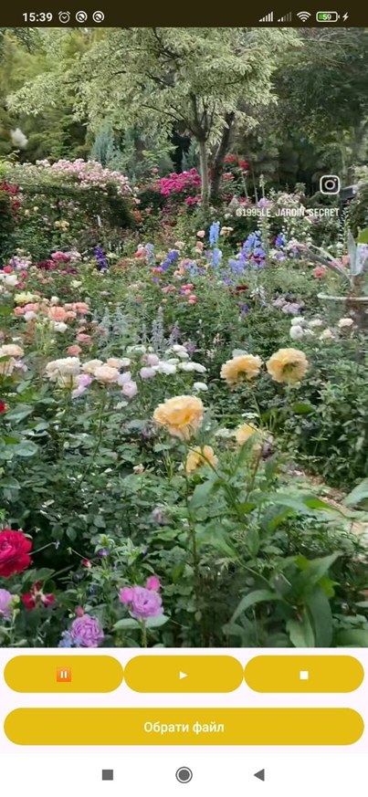

## Лабораторна робота №4

### Тема: дослідження способів роботи з медіаданими. 

До AndroidManifest.xml додано     <uses-permission android:name="android.permission.READ_EXTERNAL_STORAGE"/>

Інтерфейс було створено у файлі activity_main.xml з використанням RelativeLayout. Було додано ImageView, який відображається при старті додатку і при відтворенні аудіо. ImageView замінюється на VideoView для відтворення відео. Також додано LinearLayout infoLayout для відображення інформації про аудіо (TextView) та LinearLayout, в якому згруповано кнопки: для вибору файлу та старт/пауза/стоп.
Додатково було змінено тему оформлення у файлі AndroidManifest.xml і змінено кольори.

Для тестування використовувався телефон, підключений по usb у режимі «Для розробників». При запуску додатку інтерфейс виглядає так: 
 

Для вибору файлу зі сховища пристрою додано кнопку з id = btnChooseFile. При натисканні на неї викликається метод chooseFile(). У цьому методі використовується Intent для відкриття файлового менеджера. Intent.ACTION_OPEN_DOCUMENT відкриває системний вибір файлу.
Було додано: intent.putExtra(Intent.EXTRA_MIME_TYPES, new String[]{"audio/*", "video/*"}) – це дозволяє вибирати тільки аудіо або відео файли зі сховища телефону.
Також було додано дозвіл на читання intent.addFlags(Intent.FLAG_GRANT_READ_URI_PERMISSION).

Після вибору файлу викликається onActivityResult(). У цьому методі отримується Uri файлу currentUri = data.getData(). Після цього визначається тип файлу getContentResolver().getType(currentUri). Якщо файл відео, то використовується VideoView, якщо аудіо – використовується MediaPlayer.

Для відтворення відео використано VideoView. При виборі файлу відбувається встановлення файлу videoView.setVideoURI(currentUri). 

Для запуску треба натиснути на кнопку старт, викличеться метод videoView.start(); для паузи videoView.pause(); для зупинки videoView.stopPlayback().

При виборі відео блок інформації про аудіо ховається: infoLayout.setVisibility(GONE). 

На скріншотах нижче відображено відтворення відео: 
    

Для відтворення аудіо використано MediaPlayer (mediaPlayer = new MediaPlayer();). Встановлення файлу відбувається за допомогою mediaPlayer.setDataSource(this, currentUri).
Перед створенням нового MediaPlayer старий видаляється (mediaPlayer.release()), щоб уникнути помилки.

Для отримання інформації про аудіофайл використано MediaMetadataRetriever
Створюється за допомогою MediaMetadataRetriever mmr = new MediaMetadataRetriever(). Встановлення джерела: mmr.setDataSource(this, currentUri). Для отримання даних використовуються константи класу MediaMetadataRetriever:
METADATA_KEY_TITLE
METADATA_KEY_ARTIST
METADATA_KEY_ALBUM
METADATA_KEY_YEAR

Отримані дані виводяться у TextView:

 

### Висновок:
У ході виконання лабораторної роботи було вивчено способи роботи з мультимедійними файлами в Android.
Було реалізовано додаток, який дозволяє вибирати аудіо та відео файли зі сховища пристрою, відтворювати їх та керувати відтворенням за допомогою кнопок.

Було використано класи VideoView, MediaPlayer та MediaMetadataRetriever, що дозволило відтворювати різні типи мультимедіа та отримувати додаткову інформацію про аудіофайли.

У результаті було створено простий медіаплеєр з можливістю вибору файлу, керування відтворенням та відображення метаданих.

